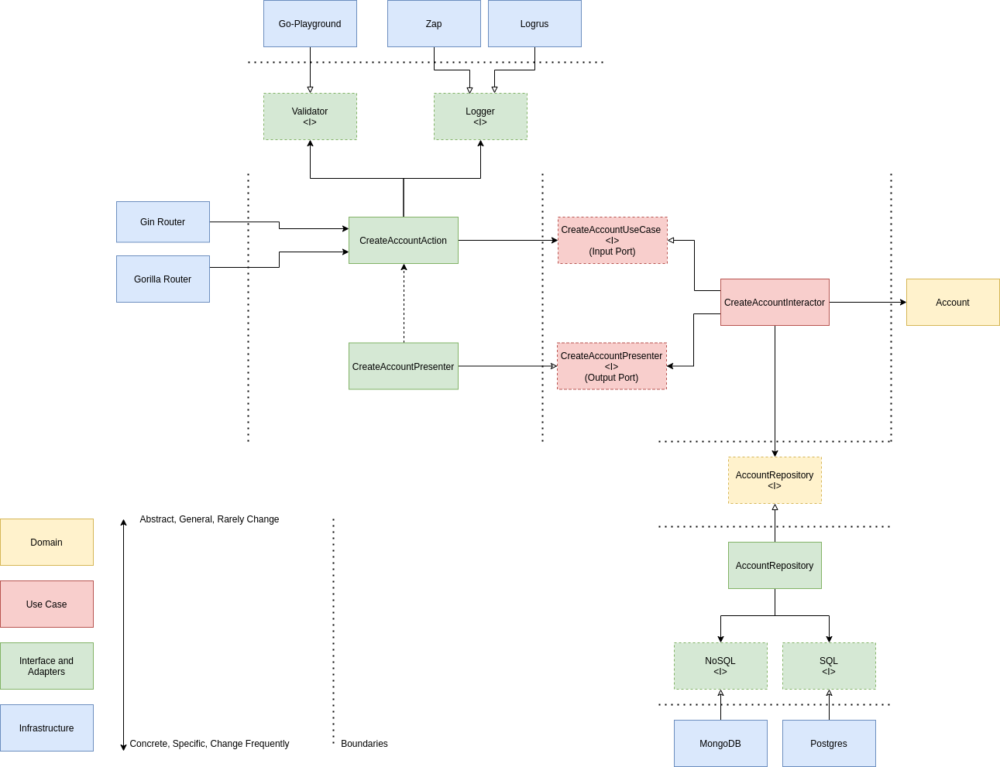

# reused-modules-api

## Start
Follow https://github.com/reused-modules/reused-modules-api/blob/main/README.md

## Hot reload
https://github.com/cosmtrek/air/
https://github.com/cosmtrek/air/issues

## Doc
<h1 align="center">Welcome to Go Clean Architecture</h1>

  
  
  
  
  
  

- The Go Clean Architecture is a user-friendly solution designed for a range of banking tasks, including account creation, account listing, checking the balance of specific accounts, facilitating transfers between accounts, and compiling transfer records.

## Architecture
-  This represents an endeavor to implement a clean architecture. In the event that you're not yet familiar with it, I'd like to provide you with a [reference](https://blog.cleancoder.com/uncle-bob/2012/08/13/the-clean-architecture.html).

## Example create account use case

